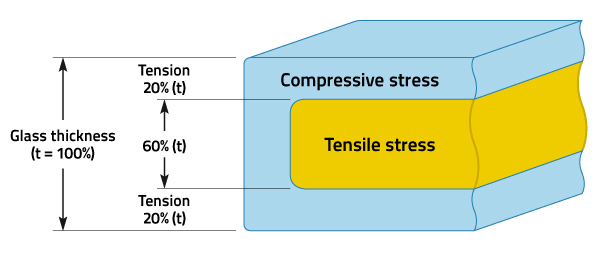

.. zettelkasten documentation master file, created by
   sphinx-quickstart on Fri Aug 19 17:00:22 2022.
   You can adapt this file completely to your liking, but it should at least
   contain the root `toctree` directive.

Shawn's Zettelkasten
====================

Started on August 19, 2022

.. toctree::
   :maxdepth: 2
   :caption: Contents:

First zettel
------------

There is a whole theory/ framework about how to `structure a zettelkasten <https://zettelkasten.de/introduction/>`_. Readthedocs is a perfect tool. Cross-referenceable, searchable, source controlled (that’s probably unnecessary). As a tool it has everything I would need, but really it’s a practice. It only works if I use it, practice it, pursue it. Which I want to do. But one thing I did take away from reading the Introduction to zettelkasten is the point that it is something to create for yourself, which is different than something you migth allow everyone to see. 

I've just tried setting a notification reminder for myself to add to this every day. I hope to make it a habit and get to the point where I can refine my process for using readthedocs as a platform.

Feedback Control
----------------
Tags: 
ODE, Dynamical systems, Frequency domain solutions

Transfer functions are simply representations of a linear time invariant ODE
Bode plots are representations of the transfer function along the imaginary axis
0. have a system
1. model it
2. have an ODE
3. move it to the frequency domain
4. do all your analysis there and don't bother moving it back to the time domain

.. math::
   H(s) = \frac{Y(s)}{F(s)} = \frac{b_m s^m + ... + b_0}{a_m s^m + ... + a_0}

.. math::
   \frac{N(s)}{D(s)} = k\frac{(s-z_1)(s-z_2) ... (s-z_m)}{(s-p_1)(s-p_2) ... (s-p_m)}

:math:`z_i` : zeros, :math:`N(s) = 0`
:math:`p_i` : poles, :math:`D(s) = 0`

Safety Glass
--------------
Tags:
tempering, material science, thermal stress, heat exchange

It's glass that breaks in a reasonably safe way. There a few different types.
Tempered glass is what the side windows of a car are made of. It is made by heating glass up and quickly cooling it which causes the outside to be in compression while the inside is in tension. The outer shell contracts when it cools and pulls on the inner core, creating compression on the outside and tension in the middle. All the energy contained in these stresses leads to the window breaking into many small pieces. 

Laminated glass is what windshields are made of. It's got two layers of glass sandwiched around a thin layer of vinyl.

